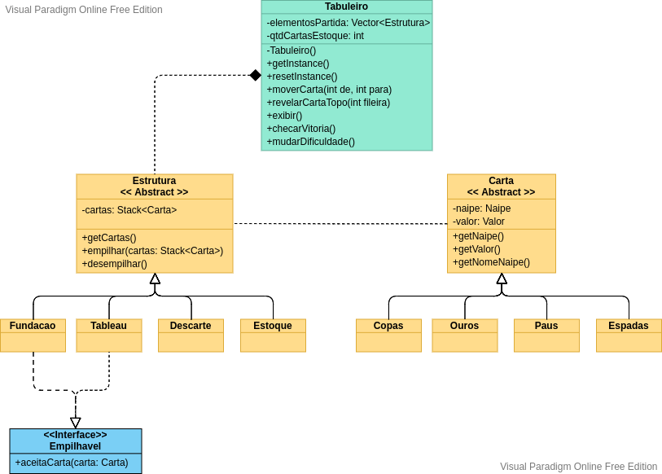

## **Paciência**

Este projeto apresenta a modelagem do Paciência, que é um jogo de cartas muito popular.

### **O projeto**

A unidade básica do jogo é a `Carta`, um baralho é composto por cartas. No caso do Paciência, as cartas podem ser dos naipes: `Copas, Ouros, Paus e Espadas`. O tabuleiro do jogo é formado por quatro estruturas: `Fundação, Tableau, Descarte e Estoque`. Cada estrutura é constituída por `Cartas` ou também podem estar vazias. 

Uma jogada acontece ao movimentar uma carta de uma `Estrutura` para outra. As estruturas de `Fundação` e `Tableau` têm regras especiais para o empilhamento de cartas, portanto é preciso verificar a pilha aceita a carta a ser movida, para isso implementam a interface `Empilhavel`. A classe `Estrutura` também define métodos para o controle de sua pilha de cartas interna.

O diagrama a seguir ilustra o modelo em alto nível do projeto.

- **Carta**: Representa uma carta do jogo. É composta   por um `Valor` e um `Naipe`.
  - **Copas**: Representa uma carta de Copas.
  - **Ouros**: Representa uma carta de Ouros.
  - **Paus**: Representa uma carta de Paus.
  - **Espadas**: Representa uma carta de Espadas.

- **Estrutura**: Representa a abstração de um elemento estrutural do tabuleiro, são eles:
  - **Tableau**: Representa uma fileira de `Cartas` alternadas por cores.
  - **Fundacao**: Representa uma pilha de `Cartas` de um mesmo `Naipe`.
  - **Descarte**: Representa a pilha de cartas reveladas do `Estoque`.
  - **Estoque**: Representa o conjunto de `Cartas` que ainda não foram utilizadas nas outras estruturas.

- **Tabuleiro**: É composto por `Estruturas` e é onde o controle do jogo acontece.
- **App**: Inicializa o programa e direciona as ações do usuário.
### **Como jogar?**

Para iniciar o jogo é preciso executar o código `App.java` presente no projeto.

As ações do jogo são realizadas através da escolha de opções no terminal.

O jogo possui as seguintes opções:

- `1 - Mover Carta`: Para realizar esta ação o usuário deve digitar `1` no terminal e pressionar `Enter`. Em seguida, será perguntada qual a movimentação o jogador deseja realizar, então deve ser digitada a posição de origem e destino da carta desejada, separados por vírgula. 

  Por exemplo: `ORIGEM,DESTINO: 9,1`, isto fará com que a carta seja deslocada para o da posição `9` para a posição `1`.

- `2 - Revelar carta do topo da fileira`: Essa opção é útil quando é necessário revelar a carta final de uma fileira em que todas as cartas estão ocultas. Ao escolher essa opção pressionando `2` seguido de `Enter`, basta digitar o número da fileira que o jogador deseja revelar.

- `3 - Exibir Jogo`: Ao escolher essa opção pressionando `3` seguido de `Enter`, o jogo exibirá no terminal o estado atual do tabuleiro.

- `4 - Alterar quantidade de cartas a serem viradas do estoque`: Para escolher essa opção o usuário deve digitar `4` seguido de `Enter`, assim, o jogo alternará a quantidade de cartas *(1 ou 3)* que são viradas do estoque a cada solicitação.

- `5 - Reiniciar`: Ao escolher essa opção pressionando `5` seguido de `Enter`, o estado do tabuleiro é reiniciado.

- `6 - Encerrar Partida`: Ao escolher essa opção pressionando `6` seguido de `Enter`, o jogo é encerrado.

### **Padrões de projetos e avaliação do sistema**
O sistema divide as responsabilidades de cada entidade baseado no seu papel no sistema. O uso do padrão *Singleton* garante que haja apenas uma instância do `Tabuleiro` durante a execução do programa, o que permite que partes diferentes do sistema interajam com a partida em andamento sem inconsistência de informações. 

A criação das estruturas que compoem um `Tabuleiro` foram abstraídas em uma *Factory* responsável por inicializar os elementos necessários para uma partida. Isso permite a criação de diferentes tipos de jogos no futuro e com poucas adaptações o `Tabuleiro` estará pronto para suportar diferentes jogos.

Uma melhoria imediata seria adicionar uma camada de abstração sobre o método `moverCarta()` do `Tabuleiro`, no entanto, a parte de controle das ações do projeto foi pensada observando a orientação [YAGNI](https://pt.wikipedia.org/wiki/YAGNI). Portanto, como só há um jogo no sistema, a implementação atual é suficiente.